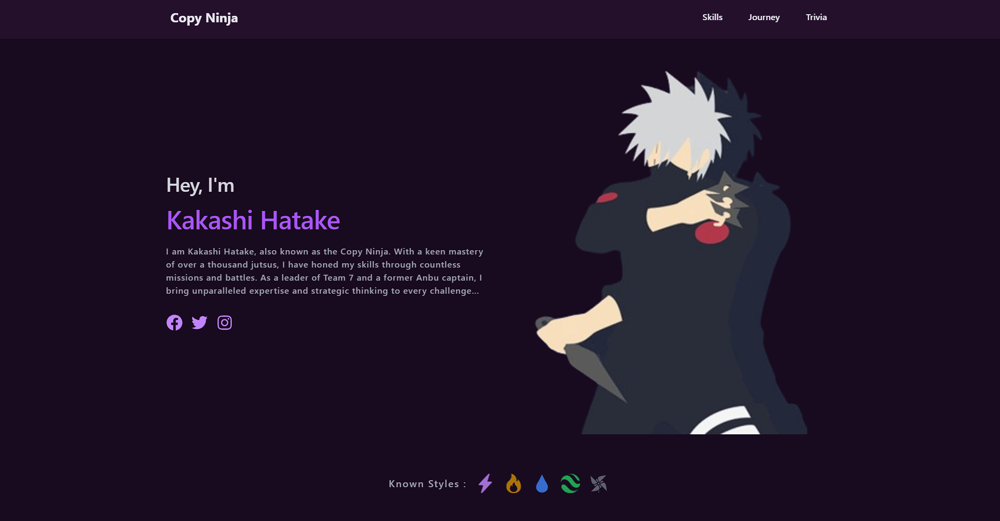

# Kakashi Hatake Fan Website

Welcome to the Kakashi Hatake Fan Website! This website is dedicated to showcasing the legendary ninja from the Naruto series, Kakashi Hatake. The site highlights key aspects of Kakashi's life, his skills, his journeys, and some interesting trivia.



## Table of Contents

- [Introduction](#introduction)
- [Features](#features)
- [Sections](#sections)
- [Technologies Used](#technologies-used)
- [Setup Instructions](#setup-instructions)
- [Contributing](#contributing)
- [License](#license)

## Introduction

This project is a fan-made website built with Vite, React, and TailwindCSS. It provides an engaging and interactive experience for Kakashi Hatake fans, presenting his story and achievements in a visually appealing manner.

## Features

- Responsive design
- Animated components
- Detailed sections about Kakashi's skills, journeys, and trivia
- Smooth scrolling navigation

## Sections

### Navbar

The navigation bar allows users to quickly access different sections of the website.

### Hero

A visually captivating section with an introduction to Kakashi Hatake.

### Skills

Highlights Kakashi's skills, including his proficiency in various ninja techniques.

### Journey

Showcases significant incidents and missions from Kakashi's life, narrated by Kakashi himself.

### Portfolio

A gallery of key moments from Kakashi's life with descriptive content.

### Trivia

Interesting trivia about Kakashi's character, including some fun facts and lesser-known details.

### Contact

A section for fans to reach out or connect with the creator.

### Footer

Contains links to social media and other relevant information.

## Technologies Used

- **Vite**: Fast and modern build tool.
- **React**: JavaScript library for building user interfaces.
- **TailwindCSS**: Utility-first CSS framework.
- **Framer Motion**: Animation library for React.

## Setup Instructions

To run this project locally, follow these steps:

1. **Clone the repository**
    ```bash
    git clone https://github.com/Jothivaanan-WebDeveloper/kakash-portfolio.git
    cd kakashi-portfolio
    ```

2. **Install dependencies**
    ```bash
    npm install
    ```

3. **Run the development server**
    ```bash
    npm run dev
    ```

4. **Open your browser**
    Navigate to `http://localhost:5173` to view the website.

## Contributing

Contributions are welcome! Please fork the repository and create a pull request with your changes. Make sure to follow the code of conduct and adhere to the project's guidelines.

## License

This project is licensed under the MIT License. See the [LICENSE](LICENSE) file for more details.